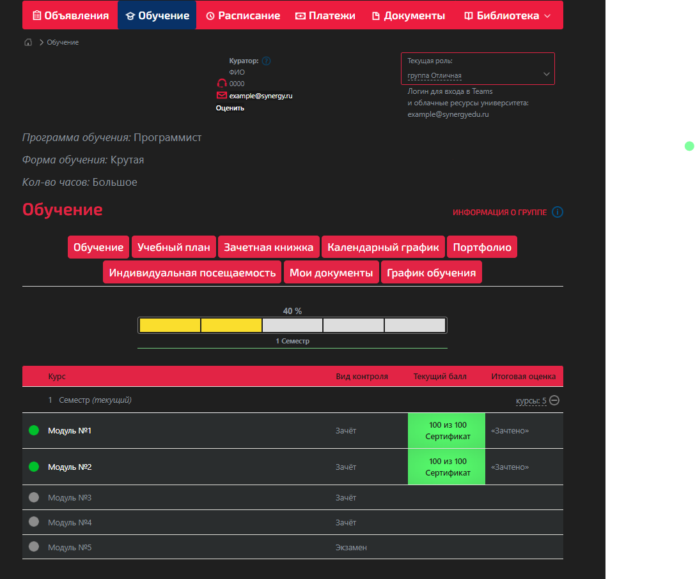
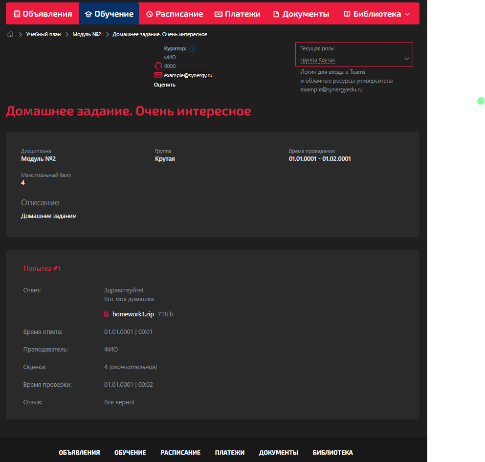

<h1 align="center">Темная тема для LMS Synergy.</h1>
<h2 align="center">

  
Как выглядит?

  
  

</h2>
<h2 align="center">Установка/Обновления стиля</h2>

  
Если расширение Stylebot не установлено

  1. Установите расширение по этой <a href="https://chromewebstore.google.com/detail/stylebot/oiaejidbmkiecgbjeifoejpgmdaleoha?hl=ru">ссылке</a> (Для тех, у кого браузер FireFox <a href="https://addons.mozilla.org/ru/firefox/addon/stylebot-web/">другая</a> ссылка)

2. Нажмите на значок расширения Stylebot и зайдите в параметры

3. Справа найдите раздел "Стили", нажмите на кнопку "Добавить новый стиль"

4. В поле "Enter URL" введите <code>lms.synergy.ru</code>

5. Скопируйте содержимое файла <code>for-copy.css</code> (<a href="https://github.com/BarPaul/synergyLMS-darktheme/blob/main/for-copy.css">он</a> лежит в этом репозиторие)

6. Ниже поля "Enter URL" вставьте скопированное содержимое

  
Должно получится примерно так

  

7. Нажмите на кнопку "Сохранить"

